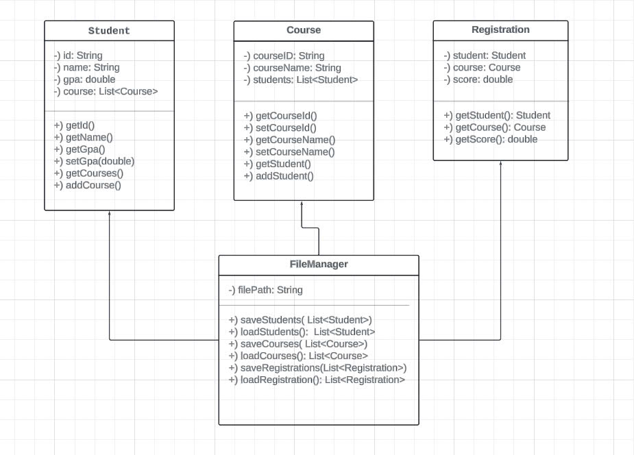
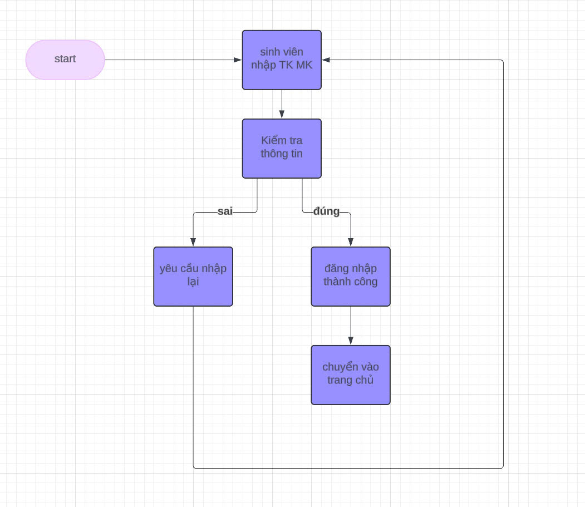

### NHÓM 4 : QUẢN LÝ SINH VIÊN 
Thành viên: 
  1. Hoàng Thị Linh Chi
     ID: 22010099
  2. Nguyễn Mạnh Tiến
     ID: 22010151

### NỘI DUNG
### 1. SƠ ĐỒ KHỐI YÊU CẦU
  ### 1.1 UML Component Diagram
   
  
  ### 1.2 UML Sequence Diagram
   Một số chức năng cơ bản:

   Đăng nhập:
   

   Thêm sinh viên:
   

   Đăng ký môn:
   

   Lọc danh sách:
   

   Đăng nhập:
   
