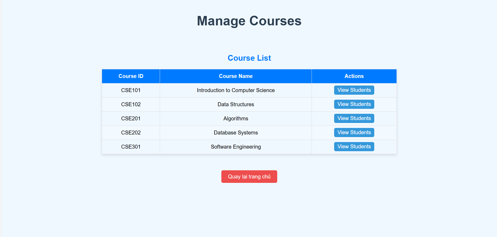

# NHÓM 4: QUẢN LÝ SINH VIÊN 
### Thành viên: 
1. **Hoàng Thị Linh Chi**
   - ID: 22010099
2. **Nguyễn Mạnh Tiến**
   - ID: 22010151

## LINK DEMO APP
[HỆ THỐNG QUẢN LÍ SINH VIÊN](https://www.youtube.com/watch?v=KtgPDJPSkQs)

## NỘI DUNG
### 1. SƠ ĐỒ KHỐI YÊU CẦU
#### 1.1 UML Component Diagram

#### 1.2 UML Sequence Diagram
Một số chức năng cơ bản:

#### Link Trang Web online
[Link Online](https://turbo-space-dollop-x5wrp46456p29vqp-8080.app.github.dev/students/1/courses)

##### Đăng nhập:

##### Thêm sinh viên:

##### Đăng ký môn:

##### Lọc danh sách:

##### Màn hình đăng nhập đầu tiên:

## Screenshots

| Login  |  Home
|:-:|:-:|
|  |  |

| Manage Student  |  View Course
|:-:|:-:|
|  |  |

| Manage Course  |  View Student
|:-:|:-:|
|  |  |

| Register Course  |  Select Register
|:-:|:-:|
|  |  |
